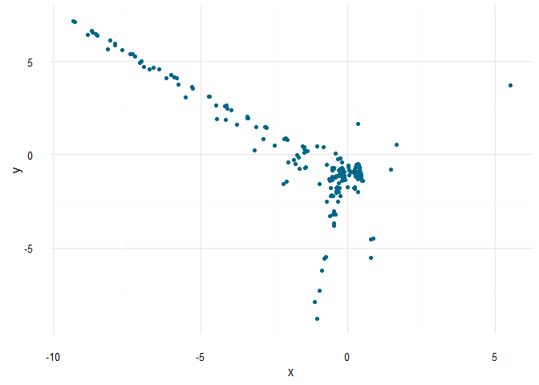
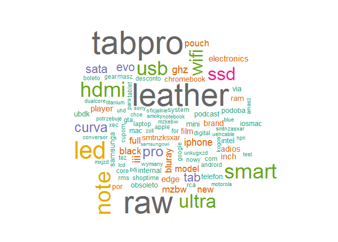

Analiza\_SocialM
================
Gevorg Khangeldyan
29 listopada 2016

-   [Samsung w mediach społecznościowych](#samsung-w-mediach-spoecznosciowych)
    -   [Zdobycie i przygotowanie tweetów](#zdobycie-i-przygotowanie-tweetow)
    -   [Latent Semantic Analysis (Analiza ukrytych grup semantycznych)](#latent-semantic-analysis-analiza-ukrytych-grup-semantycznych)
    -   [Latent Dirichlet allocation (LDA)](#latent-dirichlet-allocation-lda)
    -   [Podsumowanie](#podsumowanie)

Samsung w mediach społecznościowych
===================================

Wraz z rozwojem mediów społecznościowych, coraz więcej istotnych danych możemy znaleźć w materiałach zamieszczonych przez samych użytkowników. Tweety, posty, like’i są ogromnym źródłem wartościowych danych. Dlatego coraz istotniejsza jest umiejętność ściągnięcia oraz analizowania tego typu informacji. W tej części skupimy się głównie na dwóch innych metodach analizowania teksów mianowicie Latent semantic analysis (LSA) oraz Latent Dirichlet allocation (LDA).

Zdobycie i przygotowanie tweetów
--------------------------------

Dane zdobędziemy z popularnego serwisu Twitter i ściągniemy wszystkie tweety, które zawierają w sobie słowo klucz `samsung`. Posłużymy się w biblioteką `twitteR` i ściągniemy 2000 tweet'ów od 1 czerwca 2016r.

``` r
library(twitteR)
library(tm)
library(stringr)
library(stringi)
```

``` r
samsung <- searchTwitter("samsung", n=1000, lang = "pl",  since = '2016-06-01')
```

Kolejnym etapem będzie wydobycie teksu z tweetów, wyczyszczenie oraz przygotowanie odpowiedniej formy pod dalszą analizę.

``` r
samsung.txt <- sapply(samsung, function(x) x$getText())

clean_tweet <- function(x) {
  text <- unique(x)
  text <- str_replace_all(text, "[[:cntrl:]]", "")
  text <- str_replace_all(text, " https://t.co[[:graph:]]+","")
  text <- str_replace_all(text,"RT @[[:graph:]]*:","")
  text <- str_replace_all(text, "#[[:alnum:]_]*","")
  text <- str_replace_all(text,"@\\w+","")
  text <- stri_trans_general(text, "latin-ascii")
  return(text)
}

clean_corp <- function(corpus) {
  corpus <- tm_map(corpus, removePunctuation)
  corpus <- tm_map(corpus, removeNumbers)
  corpus <- tm_map(corpus, content_transformer(tolower))
  corpus <- tm_map(corpus, removeWords, words = c(stopwords_pl, "samsung"))
}

samsung_clean <- clean_tweet(samsung.txt)
length(samsung_clean)
```

    ## [1] 1550

``` r
samsung_corp <- VCorpus(VectorSource(samsung_clean))
samsung_corp_clean <- clean_corp(samsung_corp)
samsung_tdm <- TermDocumentMatrix(samsung_corp_clean)
samsung_tdm <- removeSparseTerms(samsung_tdm, 0.99)
```

Oto najczęściej pojawiające się słowa w zbiorze tekstów ze słowem snooper.

``` r
findFreqTerms(samsung_tdm, lowfreq = 20)
```

    ##  [1] "adios"       "black"       "bluray"      "brand"       "chromebook" 
    ##  [6] "curva"       "edge"        "electronics" "evo"         "film"       
    ## [11] "full"        "galaxy"      "ghz"         "hdmi"        "iii"        
    ## [16] "inch"        "intel"       "internal"    "iosmac"      "iphone"     
    ## [21] "leather"     "led"         "mac"         "mini"        "model"      
    ## [26] "mzbw"        "new"         "note"        "obsoleto"    "player"     
    ## [31] "podcast"     "podoba"      "por"         "pouch"       "pro"        
    ## [36] "ram"         "raw"         "samsunga"    "sata"        "sleeve"     
    ## [41] "smart"       "smtnzksxar"  "ssd"         "tab"         "tabpro"     
    ## [46] "telefon"     "ubdk"        "ultra"       "usb"         "via"        
    ## [51] "wifi"

Latent Semantic Analysis (Analiza ukrytych grup semantycznych)
--------------------------------------------------------------

Analiza ukrytych grup semantycznych jest techniką która pozwala badać podobieństwo tekstów. Dzięki niej możemy z dużą skutecznością oszacować ilość głównych wątków zawartych w naszych tekstach.

``` r
library(lsa)
library(ggplot2)
```

``` r
samsung_mat <- as.matrix(samsung_tdm)

samsung_mat_lsa <- lw_bintf(samsung_mat) * gw_idf(samsung_mat)
lsa_space <- lsa(samsung_mat_lsa)
```

    ## Warning in lsa(samsung_mat_lsa): [lsa] - there are singular values which
    ## are zero.

``` r
dist.samsung <- dist(t(as.textmatrix(lsa_space)))

fit <- cmdscale(dist.samsung, eig=TRUE, k = 2)
points <- data.frame(x=fit$points[,1], y = fit$points[,2])
```

Interpretacja wykresu jest interesująca. Można zauważyć jeden główny wątek dotyczący słowa `samsung` (punkty w środku wykresu) oraz wiele innych wątków tworzące dwie odnogi, liniowo oddalające się od głównego tematu.

``` r
ggplot(points, aes(x,y)) + 
  geom_jitter(col = "deepskyblue4") +
  theme_minimal()
```



Latent Dirichlet allocation (LDA)
---------------------------------

Inną metodą podobna do LSA jest Latent Dirichlet allocation (LDA) . Dzięki tej metodzie można uzyskać informacje dotyczące słów kluczowych głównych wątków w zbiorze tekstów. W przeciwieństwie do LSA technika LDA wykorzystuje Document Term Matrix a nie Term Document Matrix.

``` r
library(topicmodels)

dtm_samsung <- DocumentTermMatrix(samsung_corp_clean)
dtm_samsung <- removeSparseTerms(dtm_samsung, 0.99)
rowTotal <- apply(dtm_samsung, 1, sum)
dtm <- dtm_samsung[rowTotal > 0,]
```

W tym przypadku musimy ręcznie ustalić liczbę wątków, które będzie wyszukiwał algorytm. Wybierzmy ich 3.

``` r
lda_samsung <- LDA(dtm, k = 3)
term <- terms(lda_samsung, 8)
term <- apply(term, MARGIN = 2, FUN =  str_c, collapse = ", ")
```

    ##                                                  Topic 1 
    ## "galaxy, tabpro, leather, raw, sleeve, tab, wifi, black" 
    ##                                                  Topic 2 
    ##      "led, hdmi, smart, usb, ultra, curva, wifi, iphone" 
    ##                                                  Topic 3 
    ##            "galaxy, note, ssd, pro, evo, sata, iii, ghz"

Algorytm podał nam 8 głównych słów występujących w 3 wybranych przez nas wątkach. Na medium społecznościowym `Tweeter` często pojawiają się tweety z wyrazami `galaxy`, `note`. Prawdopodobnie jest to spowodowane ostatnim modelem telefonu Galaxy Note 7, który wzbudził spore zamieszanie w ostatnim czasie. W innym wątku pojawiają się słowa `led`. `hdmi`, `smart` i one dotyczą telewizorów produkowanych przez firmę *Samsung*. W ostatnim wątku często występują się słowa `galaxy` `tabpro` i dotyczącą one najnowszego tabletu wypuszczonego przez koreańską firmę.



Podsumowanie
------------

W drugiej części zaprezentowano techniki analizy tekstów pochodzących z mediów społecznościowych. W połączeniu z zaprezentowanymi tutaj LSA i LDA oraz wcześniej opisanym modelowaniu predykcyjnym daje potężny zestaw narzędzi do analizy danych pochodzących z mediów społecznościowych. Jednak wydaje się, że analiza tekstów, szczególnie krótkich komunikatów pochodzących z mediów społecznościowych jest bardziej wymagająca on analiz danych numerycznych i do jej wyników należy podejść ostrożniej. Jednak faktem jest to , że analiza danych tekstowych jest istotnym i cennym źródłem informacji w dzisiejszym świecie.
