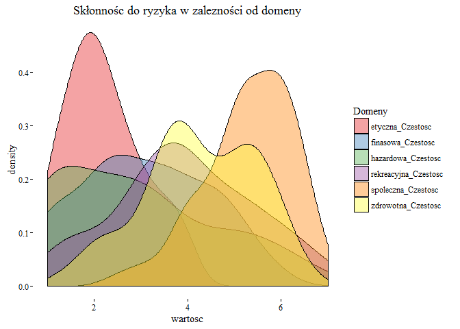
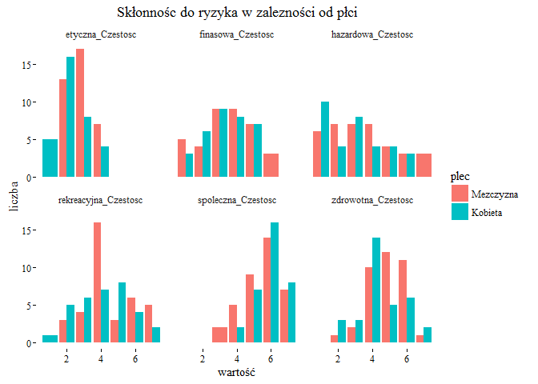
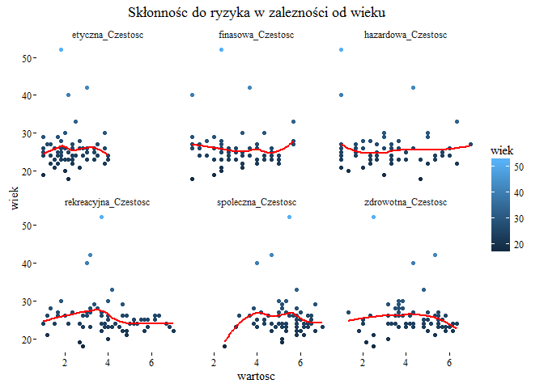
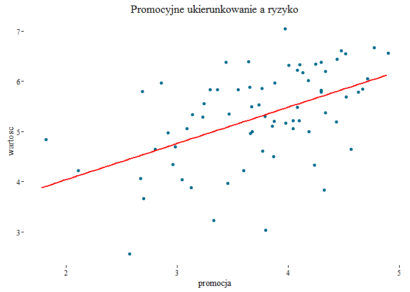
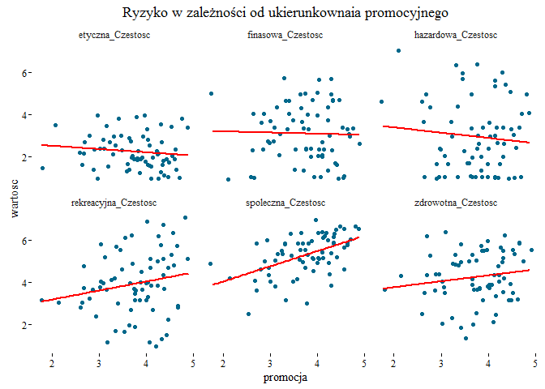
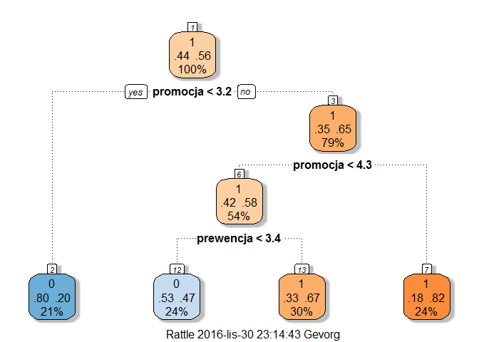

Dane kwestionariusze
================
Gevorg Khangeldyan
28 listopada 2016

-   [Przypadek z danymi kwestionariuszowymi](#przypadek-z-danymi-kwestionariuszowymi)
    -   [Czyszczenie danych](#czyszczenie-danych)
    -   [Eskploracja](#eskploracja)
    -   [Regresja liniowa](#regresja-liniowa)
    -   [Klasyfikacja za pomocą drzewka decyzyjnego.](#klasyfikacja-za-pomoca-drzewka-decyzyjnego.)
    -   [Podsumowanie](#podsumowanie)

Przypadek z danymi kwestionariuszowymi
======================================

Część ta jest przykładem sytuacji, która często się zdarza w analityce danych. Mamy pewien zbiór danych, w których są zawarte istotne informacje, jednak forma przedstawionych informacji mocno utrudnia jakiekolwiek analizy: dane są niepełne, kolumny mają mało informacyjne nazwy, ważne informacje są dostępnie dopiero po operacji na kilku kolumnach, sposób kodowana odpowiedzi jest różny i tak dalej. Przykładem takich danych są dane zebrane przeze mnie na potrzeby pracy magisterskiej. Dlatego jako studium przypadku wykorzystam te dane . Praca na takich danych jest mocną strona programy R, ponieważ istnieje spora ilość bibliotek ogromnie ułatwiających operacje na takich danych. Wielkim minusem wykorzystania tych danych jest złożona tematyka pracy magisterskiej i dla osoby nie znającej tematu pracy podążanie za treścią tego przypadku może być niekomfortowe. Dlatego postaram się maksymalnie ograniczyć kwestie związane z tematem pracy do minimum i skupie się głównie na możliwościach R.

Czyszczenie danych
------------------

Głównymi bibliotekami do czyszczenia danych w R są dplyr, stringr i tidyr. Dlatego na początek załadujemy je do programu.

``` r
library(plyr)
library(dplyr)
library(stringr)
library(tidyr)
library(magrittr)
```

    ## [1] "C:/Users/Gevorg/Projekty-w-R"

``` r
dim(data)
```

    ## [1] 140 124

``` r
names(data)
```

    ##   [1] "id"            "token"         "submitdate"    "startlanguage"
    ##   [5] "C1_1"          "C1_2"          "C1_3"          "C1_4"         
    ##   [9] "C1_5"          "C1_6"          "C1_7"          "C1_8"         
    ##  [13] "C1_9"          "C1_10"         "C1_11"         "C1_12"        
    ##  [17] "C1_13"         "C1_14"         "C1_15"         "C2_16"        
    ##  [21] "C2_17"         "C2_18"         "C2_19"         "C2_20"        
    ##  [25] "C2_21"         "C2_22"         "C2_23"         "C2_24"        
    ##  [29] "C2_25"         "C2_26"         "C2_27"         "C2_28"        
    ##  [33] "C2_29"         "C2_30"         "S1_1"          "S1_2"         
    ##  [37] "S1_3"          "S1_4"          "S1_5"          "S1_6"         
    ##  [41] "S1_7"          "S1_8"          "S1_9"          "S1_10"        
    ##  [45] "S1_11"         "S1_12"         "S1_13"         "S1_14"        
    ##  [49] "S1_15"         "S2_16"         "S2_17"         "S2_18"        
    ##  [53] "S2_19"         "S2_20"         "S2_21"         "S2_22"        
    ##  [57] "S2_23"         "S2_24"         "S2_25"         "S2_26"        
    ##  [61] "S2_27"         "S2_28"         "S2_29"         "S2_30"        
    ##  [65] "PP1_1"         "PP1_2"         "PP1_3"         "PP1_4"        
    ##  [69] "PP1_5"         "PP1_6"         "PP1_7"         "PP1_8"        
    ##  [73] "PP1_9"         "PP1_10"        "PP1_11"        "PP1_12"       
    ##  [77] "PP1_13"        "PP1_14"        "PP1_15"        "PP2_16"       
    ##  [81] "PP2_17"        "PP2_18"        "PP2_19"        "PP2_20"       
    ##  [85] "PP2_21"        "PP2_22"        "PP2_23"        "PP2_24"       
    ##  [89] "PP2_25"        "PP2_26"        "PP2_27"        "K1_1"         
    ##  [93] "K1_2"          "K1_3"          "K1_4"          "K1_5"         
    ##  [97] "K1_6"          "K1_7"          "K1_8"          "K1_9"         
    ## [101] "K1_10"         "K1_11"         "K1_12"         "K1_13"        
    ## [105] "K1_14"         "K1_15"         "K2_16"         "K2_17"        
    ## [109] "K2_18"         "K2_19"         "K2_20"         "K2_21"        
    ## [113] "K2_22"         "K2_23"         "K2_24"         "K2_25"        
    ## [117] "K2_26"         "K2_27"         "K2_28"         "K2_29"        
    ## [121] "K2_30"         "M1"            "M2"            "M3"

    ##    id token          submitdate startlanguage
    ## 1   3  <NA> 01-01-1980 00:00:00            pl
    ## 2  26  <NA>                <NA>            pl
    ## 3  11  <NA> 01-01-1980 00:00:00            pl
    ## 4   6  <NA> 01-01-1980 00:00:00            pl
    ## 5   5  <NA> 01-01-1980 00:00:00            pl
    ## 6  12  <NA> 01-01-1980 00:00:00            pl
    ## 7   4  <NA>                <NA>            pl
    ## 8  17  <NA>                <NA>            pl
    ## 9  14  <NA>                <NA>            pl
    ## 10 13  <NA>                <NA>            pl

Dane zawierają 140 obserwacji oraz 124 zmiennych. Już na pierwszy rzut oka widać, że kilka zmiennych jest niepotrzebnych i należy je usunąć. Są to zmienne token, submidate, startlanguage.

``` r
data <- data %>% 
  select(-token, -submitdate, -startlanguage)
```

Następnie sprawdzamy czy są niepełne obserwacje. Okazuje się że tak, więc je też usuwamy.

``` r
any(!complete.cases(data))
```

    ## [1] TRUE

``` r
data <- data[complete.cases(data),]
```

Pierwsza faza czyszczenia danych za nami. By zrozumieć następny etap trzeba odrobinę przybliżyć temat pracy magisterskiej. Bada ona głównie skłonność do ryzyka w różnych dziedzinach życia: finansowej, społecznej, zdrowotnej itp. W sumie jest 6 dziedzin. Dodatkowo bada ona nie tylko skłonność do ryzyka (pytania od `C1_1` do `C2_30`), ale też postrzeganie potencjalnych korzyści z ryzyka (tutaj pytania od `K1_1` do `K2_30`), potencjalne straty w sytuacji ryzykownej (od `S1_1` do `S2_30`). Każde z pytań należą od odpowiedniej domeny. By zmierzyć skłonność do ryzyka w danej domenie należy w jakiś sposób połączyć ze sobą dane z odpowiednich kolumn, np. sumując lub wyciągając średnią. Przykładowo w pytania numer, 6, 9, 10, 16, 29, 30 mierzą ryzyko w domenie etycznej. Pytanie `C1_6` mierzy skłonność do ryzyka w domenie etycznej a pytanie `K1_10` wielkość postrzeganych korzyści z sytuacji ryzykownej w domenie etyczne a `S2_16` wielkość postrzeganych straty z sytuacji ryzykownej. Cyfry 1 oraz 2 przy literach S,K i C informują o stronie na której znalazło się pytanie. Umieszczenie wszystkich 30 pytań na jednej tworzyło nieprzyjemne wrażenie natłoku pytań i mogły zniechęcić respondenta do wypełnienia ankiety. Dlatego podzielono pytania z każdej części na dwie strony po 15 dla każdej. Oczywiście można wykonać żmudną pracę sumując wszystkie 90 kolumn ręcznie za pomocą arkusza kalkulacyjnego, przesuwając suwakiem w jedna i druga stronę, jednocześnie patrząc na na plik informujący jakie pytanie należy do której domeny (wiem o czym piszę, bo tak zrobiłem) Można również ułatwić sobie życie i wykorzystać w tym celu program R.

Taki sam zabieg zastosowano w przypadku pytań `PP1_1` do `PP2_30`, które mierzą poziom ukierunkowań promocyjnego i prewencyjnego. Jednak nie zostaną tutaj dokładniej opisane, ponieważ nie są one szczególnie potrzebne w tym przypadku

``` r
etyczna <- c(6, 9, 10, 16, 29, 30)
finasowa <- c(12, 4, 18)
hazardowa <- c(3, 14, 8)
zdrowotna <- c(5, 15, 17, 20, 23, 26)
rekreacyjna <-  c(2, 11, 13, 19, 24, 25)
spoleczna <- c(1, 7, 21, 22, 27, 28)
```

Na początek napiszemy funkcję, która stworzy odpowiednie nazwy kolumn i przypisze je do właściwej listy. Stworzymy pusta listę `lista_domen`, w której będziemy magazynowali odpowiednie dane. Następnie napiszemy funkcje, która zajmie się magazynowaniem danych.

Rzućmy okiem na początek funkcji. `S1 <- str_c("S1_", x[x <= 15]) S2 <- str_c("S2_", x[x > 15]) lista_domen[[paste(deparse(substitute(x))`, "\_Straty", sep = "")\]\] &lt;&lt;- c(S1,S2) Pierwsza linia S1 &lt;- Łączy ze sobą przez funkcje `str_c` pierwszy człon, czyli `S1_` z obserwacjami mniejszymi bądź równymi niż 15. Druga linia łączy człon `S2_` z obserwacjami od 15 do 30. 3 Linia jest bardzo istotna. Tworzy ona subliste, której nazwa składa się z połączenia nazwy argumentu funkcji z członem `_Straty`. Przykładowo, jeżeli argumentem funkcji będzie wektor `etyczna` to na początku stworzy wektor z S1 z z wartościami `S1_6`, `S1_9`, `S1_10`, następnie wektor S2 z wartościami `S2_16`, `S2_29`, `S2_30`. Na końcu tworzy ona subliste z `etyczna_Straty` (nazwa argumentu i człon \_Straty) i w której umieszcza oba wektory S1 i S2. Taki sam proces odbywa się w następnych etapach funkcji gdzie tworzy subliste korzy ci i częstości.

``` r
lista_domen <- list()

dosp_fun <- function(x) {
  S1 <- str_c("S1_", x[x <= 15])
  S2 <- str_c("S2_", x[x > 15])
  lista_domen[[paste(deparse(substitute(x)), "_Straty", sep = "")]] <<- c(S1,S2)
  K1 <- str_c("K1_", x[x <= 15])
  K2 <- str_c("K2_", x[x > 15])
  lista_domen[[paste(deparse(substitute(x)), "_Korzysci", sep = "")]] <<- c(K1,K2)
  C1 <- str_c("C1_", x[x <= 15])
  C2 <- str_c("C2_", x[x > 15])
  lista_domen[[paste(deparse(substitute(x)), "_Czestosc", sep = "")]] <<- c(C1,C2)
}
```

Po wykorzystaniu funkcji otrzymujemy listę z wektorami, których nazwami są domeny a jej składowymi odpowiednie pytania tychże domen.

``` r
lista_domen
```

    ## $etyczna_Straty
    ## [1] "S1_6"  "S1_9"  "S1_10" "S2_16" "S2_29" "S2_30"
    ## 
    ## $etyczna_Korzysci
    ## [1] "K1_6"  "K1_9"  "K1_10" "K2_16" "K2_29" "K2_30"
    ## 
    ## $etyczna_Czestosc
    ## [1] "C1_6"  "C1_9"  "C1_10" "C2_16" "C2_29" "C2_30"
    ## 
    ## $spoleczna_Straty
    ## [1] "S1_1"  "S1_7"  "S2_21" "S2_22" "S2_27" "S2_28"
    ## 
    ## $spoleczna_Korzysci
    ## [1] "K1_1"  "K1_7"  "K2_21" "K2_22" "K2_27" "K2_28"
    ## 
    ## $spoleczna_Czestosc
    ## [1] "C1_1"  "C1_7"  "C2_21" "C2_22" "C2_27" "C2_28"
    ## 
    ## $hazardowa_Straty
    ## [1] "S1_3"  "S1_14" "S1_8" 
    ## 
    ## $hazardowa_Korzysci
    ## [1] "K1_3"  "K1_14" "K1_8" 
    ## 
    ## $hazardowa_Czestosc
    ## [1] "C1_3"  "C1_14" "C1_8" 
    ## 
    ## $finasowa_Straty
    ## [1] "S1_12" "S1_4"  "S2_18"
    ## 
    ## $finasowa_Korzysci
    ## [1] "K1_12" "K1_4"  "K2_18"
    ## 
    ## $finasowa_Czestosc
    ## [1] "C1_12" "C1_4"  "C2_18"
    ## 
    ## $zdrowotna_Straty
    ## [1] "S1_5"  "S1_15" "S2_17" "S2_20" "S2_23" "S2_26"
    ## 
    ## $zdrowotna_Korzysci
    ## [1] "K1_5"  "K1_15" "K2_17" "K2_20" "K2_23" "K2_26"
    ## 
    ## $zdrowotna_Czestosc
    ## [1] "C1_5"  "C1_15" "C2_17" "C2_20" "C2_23" "C2_26"
    ## 
    ## $rekreacyjna_Straty
    ## [1] "S1_2"  "S1_11" "S1_13" "S2_19" "S2_24" "S2_25"
    ## 
    ## $rekreacyjna_Korzysci
    ## [1] "K1_2"  "K1_11" "K1_13" "K2_19" "K2_24" "K2_25"
    ## 
    ## $rekreacyjna_Czestosc
    ## [1] "C1_2"  "C1_11" "C1_13" "C2_19" "C2_24" "C2_25"
    ## 
    ## $promocja
    ## [1] "PP1_1"  "PP1_3"  "PP1_5"  "PP1_6"  "PP1_14" "PP2_18" "PP2_19" "PP2_23"
    ## [9] "PP2_27"
    ## 
    ## $prewencja
    ##  [1] "PP1_2"  "PP1_4"  "PP1_7"  "PP1_9"  "PP1_11" "PP1_12" "PP2_16"
    ##  [8] "PP2_17" "PP2_21" "PP2_24" "PP2_25"

Teraz możemy stworzyć pętle, którą stworzy nowe kolumny, w której będą zawarte miary ryzyka w odpowiednich domenach. Jako miara została wybrana tutaj średnia.

``` r
dane <- sapply(data, as.numeric)
dane <- as.data.frame(dane)

for (i in 1:length(lista_domen)) {
  name <- attr(lista_domen[i], "names")
  dane <<- dane %>% mutate(newCOLname =  rowMeans(.[lista_domen[[i]]]))  
  colnames(dane)[colnames(dane)=="newCOLname"] <- name
}
```

Prześledźmy, co się stało w powyżej pętli. W pierwszej iteracji pętla bierze pierwszą subliste z `lista_domen`, czyli `etyczna_Straty` i przypisuje jej nazwę do obiektu `name`. Następnie tworzy nową kolumnę o nazwie `newColname`, w której znajduje się średnia wyciągnięta z kolumn, których nazwy są wymienione w subliście. Na sam koniec funkcja przypasuje nową nazwę dla nowej kolumny. Proces ten odbywa się dla wszystkich sublist w `lista_domen`

``` r
names(dane[,122:141])
```

    ##  [1] "etyczna_Straty"       "etyczna_Korzysci"     "etyczna_Czestosc"    
    ##  [4] "spoleczna_Straty"     "spoleczna_Korzysci"   "spoleczna_Czestosc"  
    ##  [7] "hazardowa_Straty"     "hazardowa_Korzysci"   "hazardowa_Czestosc"  
    ## [10] "finasowa_Straty"      "finasowa_Korzysci"    "finasowa_Czestosc"   
    ## [13] "zdrowotna_Straty"     "zdrowotna_Korzysci"   "zdrowotna_Czestosc"  
    ## [16] "rekreacyjna_Straty"   "rekreacyjna_Korzysci" "rekreacyjna_Czestosc"
    ## [19] "promocja"             "prewencja"

Po stworzeniu nowych kolumn możemy już usunąć niepotrzebne. Dodatkowo wykorzystamy opcje `gather`, która ma zadanie zmiany formy przedstawionych danych z wide na long, zgodnie z zasadami [tidy data](https://www.jstatsoft.org/article/view/v059i10). Dzięki tej operacji zmienne zamiast w kolumnach będą przedstawione w wierszach. Taki zabieg zdecydowanie ułatwia tworzenie modeli czy wizualizacji.

``` r
dane <- dane %>% select(id, M1:prewencja) %>%
                 gather(domena, wartosc, 5:22) %>%
                 arrange(id, domena)
```

Jak widać po kilku zabiegach uzyskaliśmy porządna formę danych. Z 121 kolumn zmniejszyliśmy ich liczbę do 8. Na koniec zmienimy nazwy kolumn, ponieważ M1, M2, M3 są mało informacyjne. Dodatkowo w kolumnie M2, która informuje o płci respondenta, zamienimy zmienne numeryczne 1, 2 odpowiednio na mężczyzna i kobieta.

    ##   id M1 M2 M3 promocja prewencja            domena  wartosc
    ## 1  1  2 23  4 3.888889  3.090909  etyczna_Czestosc 3.000000
    ## 2  1  2 23  4 3.888889  3.090909  etyczna_Korzysci 5.333333
    ## 3  1  2 23  4 3.888889  3.090909    etyczna_Straty 4.333333
    ## 4  1  2 23  4 3.888889  3.090909 finasowa_Czestosc 4.666667
    ## 5  1  2 23  4 3.888889  3.090909 finasowa_Korzysci 5.666667
    ## 6  1  2 23  4 3.888889  3.090909   finasowa_Straty 4.333333

``` r
plec <- ifelse(dane$M1 == 1, "Mezczyzna", "Kobieta") 
dane$M1 <- as.factor(plec)
levels(dane$M1) <- c("Mezczyzna", "Kobieta")
colnames(dane) <- c("id", "plec", "wiek", "wyksztalcenie", "promocja", "prewencja", "domena", "wartosc")
```

    ##    id      plec wiek wyksztalcenie promocja prewencja               domena
    ## 1   1 Mezczyzna   23             4 3.888889  3.090909     etyczna_Czestosc
    ## 2   1 Mezczyzna   23             4 3.888889  3.090909     etyczna_Korzysci
    ## 3   1 Mezczyzna   23             4 3.888889  3.090909       etyczna_Straty
    ## 4   1 Mezczyzna   23             4 3.888889  3.090909    finasowa_Czestosc
    ## 5   1 Mezczyzna   23             4 3.888889  3.090909    finasowa_Korzysci
    ## 6   1 Mezczyzna   23             4 3.888889  3.090909      finasowa_Straty
    ## 7   1 Mezczyzna   23             4 3.888889  3.090909   hazardowa_Czestosc
    ## 8   1 Mezczyzna   23             4 3.888889  3.090909   hazardowa_Korzysci
    ## 9   1 Mezczyzna   23             4 3.888889  3.090909     hazardowa_Straty
    ## 10  1 Mezczyzna   23             4 3.888889  3.090909 rekreacyjna_Czestosc
    ##     wartosc
    ## 1  3.000000
    ## 2  5.333333
    ## 3  4.333333
    ## 4  4.666667
    ## 5  5.666667
    ## 6  4.333333
    ## 7  1.000000
    ## 8  5.333333
    ## 9  5.333333
    ## 10 4.500000

Eskploracja
-----------

``` r
library(ggplot2)
library(RColorBrewer)
library(ggthemes)
```

``` r
dane %>% 
  filter(grepl("Czestosc", domena)) %>%
  ggplot(aes(x = wartosc, fill = domena)) +
  geom_density(alpha = 0.4) + 
  theme_tufte() +
  scale_fill_brewer("Domeny", palette = "Set1")+
  ggtitle("Skłonnośc do ryzyka w zalezności od domeny")
```



Przedstawimy tutaj kilka wykresów. Na pierwszym z nich doskonale widać, Że Polacy najwięcej ryzyka podejmują w dziadzinach społecznych a najmniej w domenie etycznej.

``` r
dane %>%
  filter(grepl("Czestosc", domena)) %>%
  ggplot(aes(x = ceiling(wartosc), fill = plec)) +
  geom_bar(position = "dodge") +
  theme_tufte() +
  facet_wrap(~ domena, ncol = 3) +
  ggtitle("Skłonnośc do ryzyka w zalezności od płci") +
  xlab("wartość") +
  ylab("liczba")
```



W drugiej natomiast, Że Polki podejmują więcej ryzyka w sytuacjach społecznych a Polacy w dziedzinie zdrowotnej.

``` r
dane %>%
  filter(grepl("Czestosc", domena)) %>%
  ggplot(aes(x = wartosc, y = wiek, colour = wiek)) +
  geom_point() +
  geom_smooth(se=FALSE, col = "red") +
  theme_tufte() +
  facet_wrap(~ domena, ncol = 3) +
  ggtitle("Skłonnośc do ryzyka w zalezności od wieku")
```



W ostatnia grafika pokazuje skłonność do ryzyka w różnych domenach w zależności do wieku. Jak widać powyżej nie występuje żadna zależność.

Regresja liniowa
----------------

W analizie danych jedną z najpopularniejszych metod modelowania jest regresja liniowa. W tej części przeprowadzimy analizę właśnie tą metodą i skupimy się jedynie na domenie społecznej, dla oszczędzenia czasu.

``` r
dane %>% 
  filter(grepl("spoleczna_Czestosc", domena)) %>%
  lm(wartosc ~ promocja + prewencja + wiek + plec, data=.) %>%
  summary()
```

    ## 
    ## Call:
    ## lm(formula = wartosc ~ promocja + prewencja + wiek + plec, data = .)
    ## 
    ## Residuals:
    ##      Min       1Q   Median       3Q      Max 
    ## -2.16816 -0.45317  0.00932  0.60417  1.68092 
    ## 
    ## Coefficients:
    ##             Estimate Std. Error t value Pr(>|t|)    
    ## (Intercept) 2.128547   1.007652   2.112   0.0385 *  
    ## promocja    0.700767   0.153273   4.572 2.22e-05 ***
    ## prewencja   0.052846   0.170767   0.309   0.7580    
    ## wiek        0.009327   0.021304   0.438   0.6630    
    ## plecKobieta 0.260612   0.208154   1.252   0.2151    
    ## ---
    ## Signif. codes:  0 '***' 0.001 '**' 0.01 '*' 0.05 '.' 0.1 ' ' 1
    ## 
    ## Residual standard error: 0.831 on 65 degrees of freedom
    ## Multiple R-squared:  0.2758, Adjusted R-squared:  0.2313 
    ## F-statistic: 6.189 on 4 and 65 DF,  p-value: 0.0002776

Zmienna zależna w modelu jest skłonność do ryzyka a zmiennymi niezależnymi ukierunkowanie promocyjne, prewencyjne, wiek oraz pleć. Jak widać z powyższej analizy tylko ukierunkowanie promocyjne jest zmienną istotną.

``` r
dane %>%
  filter(grepl("spoleczna_Czestosc", domena)) %>%
  ggplot(aes(x = promocja, y = wartosc)) + 
  geom_jitter(col = "deepskyblue4") +
  geom_smooth(col = "red", size = 1, se=F, method = "lm") +
  theme_tufte() +
  ggtitle("Promocyjne ukierunkowanie a ryzyko")
```



``` r
dane %>%
  filter(grepl("Czestosc", domena)) %>%
  ggplot(aes(x = promocja, y = wartosc)) +
  geom_jitter(col = "deepskyblue4") +
  geom_smooth(se=FALSE, col = "red", method = "lm") +
  theme_tufte() +
  facet_wrap(~ domena, ncol = 3) +
  ggtitle("Ryzyko w zależności od ukierunkownaia promocyjnego")
```



Klasyfikacja za pomocą drzewka decyzyjnego.
-------------------------------------------

Kolejną metodą spotykaną w analizie danych jest klasyfikacja za pomocą drzewka decyzyjnego. W porównaniu do regresji liniowej jest prostsza i praktyczniejsza w zastosowaniu. W celu przeprowadzenia analizy zmienna skłonność do ryzyka zamieniono za zmienną binarną przyjmującą wartości, 0 gdy wartość zmiennej ryzyko była mniejsza od mediany ryzyka. W przypadku przeciwnym przyjmowała wartość 1. Analiza znów się skupiała na domenie społecznej.

    ##     wartosc     
    ##  Min.   :2.500  
    ##  1st Qu.:4.708  
    ##  Median :5.333  
    ##  Mean   :5.300  
    ##  3rd Qu.:6.000  
    ##  Max.   :7.000

``` r
library(rpart)
library(randomForest)
library(partykit)
library(rattle)
library(rpart.plot)
```

``` r
ryzyko_rpart <- rpart(binary_war ~ promocja + prewencja + wiek + plec,
                      data = ryzyko_spol, method = "class")
```

``` r
fancyRpartPlot(ryzyko_rpart, palettes = c("Blues", "Oranges"))
```



Jak widać z analizy drzewka decyzyjnego, jeżeli poziom ukierunkowania promocyjnego jest niższy niż 3.2 to skłonność do ryzyka w domenie społecznej jest niższa niż wartość mediany. W przypadku, gdy jest większa niż 4.3 to skłonność do ryzyka jest większa od mediany. Jeśli jest pomiędzy 3.2 A 4.3 to w grę wchodzi poziom ukierunkowania prewencyjnego. Jeżeli poziom tego ukierunkowania jest mniejszy niż 3.4 To skłonność do ryzyka jest mała, gdy większa skłonność ta jest wysoka.

Podsumowanie
------------

W powyższym przypadku zostało umówionych wiele zagadnień często spotykanych w data science. Miedzy innymi czyszczenie danych, eksploracja danych, wizualizacja, tworzenie modeli regresji liniowej oraz drzewka decyzyjnego. Każdy z tych etapów jest nieodzownym elementem pracy w analizie danych. Wydaje się jednak, że najważniejszym etapem jest etap przygotowywania danych. Proces ten jest najbardziej czasochłonny i często frustrujący, ale jeżeli przeprowadzony starannie to proces eksploracji danych staje się stosunkowo łatwy, a często nawet interesujący i przyjemny.
