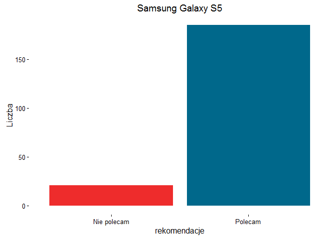
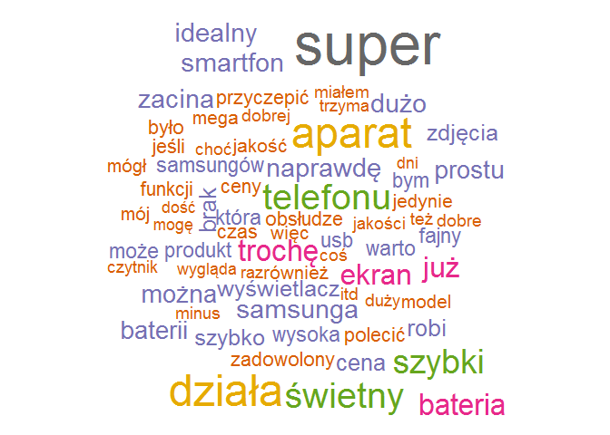
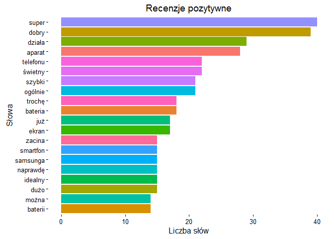
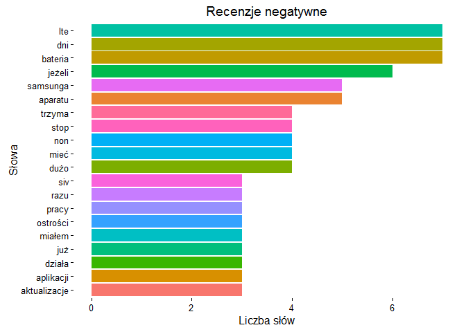
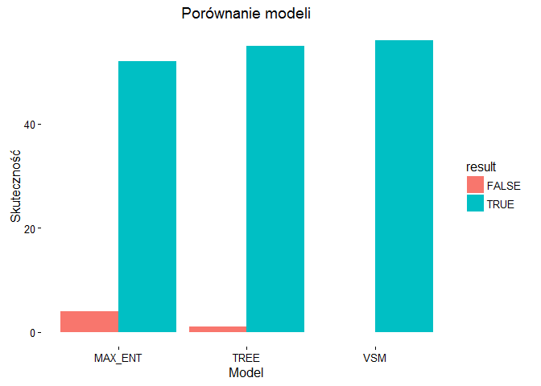

Projekt\_Samsung
================
Gevorg Khangeldyan
24 października 2016

-   [Samsung Galaxy S5 na ceneo.pl](#samsung-galaxy-s5-na-ceneo.pl)
    -   [Uzyskiwanie danych ze strony internetowej](#uzyskiwanie-danych-ze-strony-internetowej)
    -   [Tworzenie korpusu](#tworzenie-korpusu)
    -   [Wizualizacja](#wizualizacja)
    -   [Modelowanie](#modelowanie)
    -   [Podsumowanie](#podsumowanie)

W pliku są zawarte są przykłady technik stosowanych w `Data Science` w szczególności w analizie danych tekstowych. W niniejszym dokumencie zastosowano m.in. techniki:

-   zdobywania, obróbki i analizy tekstu pochodzących ze stron html

-   wizualizacji danych

-   tworzenie modeli predykcyjnych na podstawie danych tekstowych

-   sciąganie danych tekstowych z portali społecznościowych

-   analizy Latent Semantic Analysis oraz Latent Dirichlet allocation oraz

\newpage
Samsung Galaxy S5 na ceneo.pl
=============================

Portal Ceneo.pl to strona zajmująca się porównywaniem cen produktów. Na jej stronie można znaleźć również opinie zamieszczone przez użytkowników. W skład opinii wchodzą: tekst napisany przez użytkownika, liczba gwiazdek przypisana produktowi i czy produkt jest ogólnie polecany czy nie. Dla biznesu strony typu Ceneo.pl są ogromnym źródłem istotnych informacji, które mogą się przydać w procesie podejmowania decyzji W niniejszym przykładzie posłużono się opiniami telefonu Samsung Galaxy S5, ponieważ produkt ten posiada relatywnie dużo opinii (ponad 200), oraz znajdują się zarówno opinie rekomendujące telefon jak i odradzające zakup.

Uzyskiwanie danych ze strony internetowej
-----------------------------------------

W celu uzyskania potrzebnych danych załadowano odpowiednie biblioteki.

``` r
library(RCurl)
library(XML)
library(stringr)
library(dplyr)
```

Po załadowaniu bibliotek można przejść do napisania pętli, która zajmie ściągnięciem stron internetowych na których znajdują się opinie. Do celu potrzebne będą strona bazowa Ceneo.pl, pierwsza strona [recenzji](http://www.ceneo.pl/28542739#tab=reviews), oraz ścieżka xpath umożliwiająca przejście do następnej strony. Liczba stron recenzji wynosi w sumie 21.

``` r
url <- getURL("http://www.ceneo.pl/28542739#tab=reviews")
baseurl <- "www.ceneo.pl"

path <- "//*[@class='page-arrow arrow-next']/a/@href"
lista_stron <- list()
lista_stron <- url

for (i in 2:21) {
  nastepna <- xpathSApply(htmlParse(lista_stron[[i-1]]), path)
  nastena <- unlist(nastepna)
  nastepna <- str_c(baseurl, nastepna)
  lista_stron[[i]] <- getURL(nastepna)
}
```

``` r
length(lista_stron)
```

    ## [1] 21

Jak widać liczba stron w znajdująca w liście 21, więc strony ściągnęły się prawidłowo. Teraz można przejść do ściągnięcia potrzebnych informacji. Dla potrzeb tego przypadku zostaną ściągnięte opinie słowne napisane przez użytkownika oraz informacja czy produkt jest polecany bądź nie. Ta druga informacja pozwoli na sklasyfikowanie pozytywnych i negatywnych recenzji, co będzie potrzebne później.

Funkcja ściągająca opinie

``` r
funOpinia <- function(x) {
  opi <- unlist(xpathApply(htmlParse(x), 
                               "//div[@class='content-wide-col']/p[position()=1 and not(contains(@class, 'product-question-title'))]",
                           xmlValue))
}

opinie <- unlist(lapply(lista_stron, funOpinia))
```

Funkcja ściągająca rekomendacje.

``` r
funRekomen <- function(x) {
  rekom <- unlist(xpathApply(htmlParse(x), 
                             "//div[@class='product-review-summary']/em", xmlValue))
}

rekomendacje <- unlist(lapply(lista_stron, funRekomen))
```

W tym miejscu warto dodać, że ścieżka xpath dla opinii jest zdecydowanie dłuższa niż dla rekomendacji. Zawiera w sobie dodatkowy człon filtrujący /p\[position()=1 oraz not(contains(@class, 'product-question-title'))\]. Pierwszy ma zadanie filtrowanie tylko opinii, ponieważ Ceneo.pl umożliwia wpisywanie komentarzy pod opiniami. Bez pierwszego członu R ściąga wszystkie komentarze co sprawia, że długość wektora opinii oraz rekomendacji jest różna. Drugi człon uniemożliwia ściągnięcie pytań zadawanych przez internautów odnośnie tego produktu. Pytania te znajdują się pod tą sama ścieżką xpath. Uwzględnienie tych pytań też sprawia ze długość wektorów opinii i rekomendacji jest różna co uniemożliwia przypisane tych odpowiednich rekomendacji do opinii.

W sumie zostało ściągniętych 206 opinii tekstowych i 206 rekomendacji z czego 21 odradzało zakup produktu.

``` r
length(opinie)
```

    ## [1] 206

``` r
length(rekomendacje) == length(opinie)
```

    ## [1] TRUE

``` r
library(ggplot2)
ggplot(dane_S5, aes(x = rekomendacje)) + 
  geom_bar(fill = c("firebrick2", "deepskyblue4")) +
  theme_classic() +
  ggtitle("Samsung Galaxy S5") +
  ylab("Liczba")
```



Tworzenie korpusu
-----------------

Po zdobyciu potrzebnych informacji przechodzimy do jej analizy. Na połączymy opinie z rekomendacjami w data frame, by potem wyodrębnić‡ dobre i złe opinie.

``` r
dane_S5 <- data.frame(opinie = opinie, rekomendacje = rekomendacje)
zle <- dane_S5[str_detect(dane_S5$rekomendacje, "Nie polecam"),] %>% select(opinie) 
dobre <- dane_S5[str_detect(dane_S5$rekomendacje, "Polecam"),] %>% select(opinie) 
```

Do analizy tekstu potrzebna będzie biblioteka tm, za pomocą której stworzymy i wyczyścimy corpus, który będzie podstawą do dalszej analizy tekstu.

``` r
library(tm)

dobre_source <- DataframeSource(dobre)
dobre_corp <- VCorpus(dobre_source)
zle_source <- DataframeSource(zle)
zle_corp <- VCorpus(zle_source)
```

Po stworzeniu korpusu dobrych i złych opinii przechodzimy do wyczyszczenia korpusu. Dla tego celu stworzono funkcje, która usprawni ten proces.

``` r
clean_corp <- function(corpus) {
  corpus <- tm_map(corpus, removePunctuation)
  corpus <- tm_map(corpus, removeNumbers)
  corpus <- tm_map(corpus, content_transformer(tolower))
  corpus <- tm_map(corpus, removeWords, c(stopwords_pl, "telefon", "samsung", "galaxy", "polecam"))
}

clean_dobre <- clean_corp(dobre_corp)
clean_zle <- clean_corp(zle_corp)
```

Wizualizacja
------------

Dobrym i szybkim sposobem wizualizacji danych jest tzw. `wordcloud`. Pozwala w przystępny sposób zobrazować słowa kluczowe i częstotliwość ich występowania. Inny skutecznym (trochę mniej efektownym) sposobem jest bar plot, który przedstawia w inny sposób częstotliwość kluczowych słów.

``` r
library(wordcloud)
library(RColorBrewer)
```

``` r
fromCorpToDF <- function(doc) {
  doc <- TermDocumentMatrix(doc)
  doc <- as.matrix(doc)
  doc <- rowSums(doc)
  doc <- sort(doc, decreasing = TRUE)
  doc <- data.frame(name = names(doc),
                           num = doc)
}
zle_freq <- fromCorpToDF(clean_zle)
dobre_freq <- fromCorpToDF(clean_dobre)
```

``` r
my_colors <- brewer.pal(8, "Dark2") 

wordcloud(dobre_freq$name, dobre_freq$num,
          max.words = 70, colors = my_colors)
```



``` r
ggplot(dobre_freq[1:20,], aes(x = reorder(name, num), y = num, fill = name)) +
  geom_bar(stat = "identity") +
  coord_flip() +
  guides(fill=FALSE) +
  theme_classic() +
  ylab("Liczba słów") +
  xlab("Słowa") +
  ggtitle("Recenzje pozytywne")
```



``` r
ggplot(zle_freq[1:20,], aes(x = reorder(name, num), y = num, fill = name)) +
  geom_bar(stat = "identity") +
  coord_flip() +
  guides(fill=FALSE) +
  theme_classic() +
  ylab("Liczba słów") +
  xlab("Słowa")+
  ggtitle("Recenzje negatywne")
```



Jak widać z przedstawionych wykresów, pozytywne recenzje poza aprobującymi epitetami (super, dobry, świetny, idealny), zawierają słowa dotyczące szybkości działania, aparatu, baterii, wyświetlacza. Ciekawe jest to, że w negatywnych recenzjach też pojawia się słowa dotyczące aparatu i baterii. Poza tym w negatywnych komentarzach bardzo często wspomina się o lte, aplikacjach oraz aktualizacjach.

Modelowanie
-----------

Ważnym procesem podczas analizy danych tekstowych jest tworzenie modeli predykcyjnych. Modele te, przy pomocy słów występujących w tekście starają się zaklasyfikować dane teksty to określonych przez analityka kategorii. Tutaj dzięki zebraniu informacji na temat tego czy konsumenci rekomendują produkt czy nie, stworzymy modele, które mają za zadanie przewidzieć za pomocą samego tekstu czy recenzja poleca produkt czy jednak odradza jego zakup.

``` r
library(RTextTools)
```

Przechodzimy przez standardową procedurę tworzenia korpusu tekstu i wektora rekomendacji.

``` r
text <- dane_S5$opinie
oceny <- dane_S5$rekomendacje

text_corp <- VCorpus(VectorSource(text))

text_clean <- clean_corp(text_corp)
dtm <- DocumentTermMatrix(text_clean)
dtm <- removeSparseTerms(dtm, 0.99)

oceny_car <- as.character(oceny)
```

Następnie tworzymy kontenera, który będzie zawierał‚ informacje dotyczące wielkości modelu trenującego oraz modelu testowanego. 150 obserwacji z 206 przeznaczymy na model trenujący a resztę na testowanie jakości modelu.

``` r
N <- length(oceny_car)
container <- create_container(dtm,
                              labels = oceny_car,
                              trainSize = 1:150,
                              testSize = 151:N,                             
                              virgin = FALSE)
```

Teraz możemy przejść do tworzenia modeli predykcyjnych. Jest wiele rodzajów modeli, my jednak skupimy się na 3 najczęściej spotkanych Support Vector Machine, Decision Tree Method oraz Maximum Entropy Method.

``` r
svm_model <- train_model(container, "SVM")
tree_model <- train_model(container, "TREE" )
max_entr <- train_model(container, "MAXENT")

svm_out <- classify_model(container,  svm_model)
tree_out <- classify_model(container,  tree_model)
max_out <- classify_model(container,  max_entr)  

EvalDF <- data.frame(oceny_car[151:N],
                     svm = as.character(svm_out[,1]),
                     tree = as.character(tree_out[,1]),
                     maxent = as.character(max_out[,1]),
                     stringsAsFactors = FALSE)
```

Sprawdźmy jak modele radzą sobie z predykacja tekstu.

-   **Vector Suppor Machine**

<!-- -->

    ## 
    ## TRUE 
    ##    1

-   **Decision Tree Method**

<!-- -->

    ## 
    ##      FALSE       TRUE 
    ## 0.01785714 0.98214286

-   **Maximum Entropy Method**

<!-- -->

    ## 
    ##      FALSE       TRUE 
    ## 0.07142857 0.92857143



Jak widać wszystkie modele osiągają bardzo wysokie wskaźniki. Vector Suppor Machine model potrafi z 100% skutecznością przewidzieć czy tekst rekomenduje produkt czy nie. Wyniki osiągnięcie przez modele są zachęcające jednak zęby nie popaść w huraoptymizm należy dodać, że wszystkie modele tutaj z łatwością powinny osiągnąć ponad 90% skuteczność, gdyż taki byłby wynik, gdybyśmy na ślepo przypisali wszystkie teksty do ocen rekomendujących.

Dlatego też wynik modelu MAX\_ENT, który osiągnął w tym przypadku 92% nie jest już wcale taki zachwycający

Podsumowanie
------------

W powyższej części się skupiliśmy się na ważnej części pracy w data science, czyli operacji na nieustrukturyzowanych danych tekstowych pochodzących z Internetu. W biznesie coraz to większa wartość maja opinie klientów zamieszczone w Internecie ponieważ dostarczają natychmiastowego feedback’u odnośnie produktów. Eksplorując tekst wykorzystano popularne techniki wizualizacyjne, które w prosty i przystępny sposób potrafią zakomunikować ważne informacje dostępne w tekście. Z kolei tworzenie tekstowych modeli predykcyjnych umożliwia natychmiastową klasyfikacje ogromnej treści danych tekstowych. Szczególnie są one przydatne do analizy treści powstałych w mediach społecznościowych, które bez technik wyżej opisanych, byłyby niemożliwe do ogarnięcia.
